# Black-Snake

# Part I - Introduction to threads in JAVA

* define the life cycle of a thread that prints the numbers between A and B on the screen.
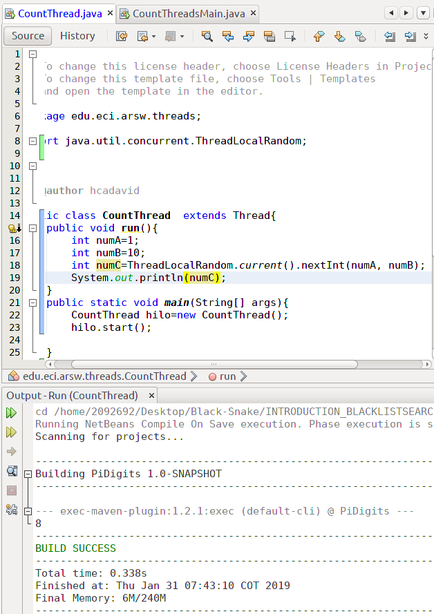

* Create 3 threads of type CountThread, assigning the first interval [0..99], the second [99..199], and the third [200..299].
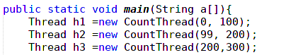

* Start the three threads with start().

* Change the beginning with start() to run(). How does the output change? Why?.

--->Change the output because with start () the numbers come out in order and the method () comes out in order and the subprocesses are running in a specific order and not simultaneously as in start ().
.png)

# Part II - Black List Search Exercise

* Create a Thread class that represents the life cycle of a thread that searches for a segment of the pool of available servers. Add to that class a method that allows you to ask the instances of it (the threads) how many occurrences of malicious servers it has found or found.
 
* Add to the checkHost method an integer parameter N, corresponding to the number of threads between which the search will be carried out (remember to take into account if N is even or odd!). Modify the code of this method so that it divides the search space between the indicated N parts, and parallels the search through N threads. Have that function wait until the N threads finish solving their respective sub-problem, add the occurrences found for each thread to the list that returns the method, and then calculate (adding the total number of occurrences found for each thread) if the Number of occurrences is greater than or equal to BLACK_LIST_ALARM_COUNT. If this is the case, in the end the host MUST be reported as reliable or not reliable, and the list should be shown with the numbers of the respective blacklists.

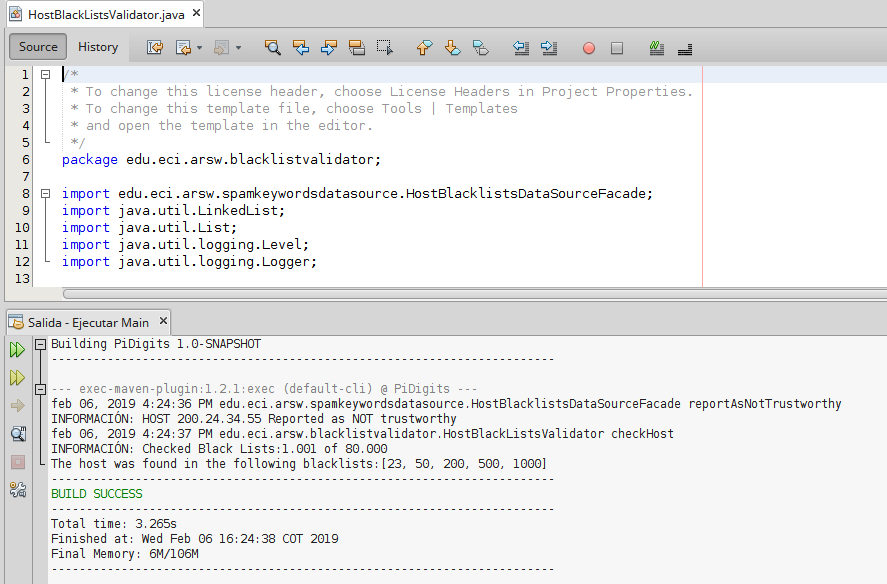

# Part III - Discussion
The strategy of parallelism previously implemented is inefficient in certain cases, since the search is still carried out even when the N threads (as a whole) have already found the minimum number of occurrences required to report to the server as malicious. How could the implementation be modified to minimize the number of queries in these cases? What new element would this bring to the problem?
    
---> The solution could be modified so that when a thread finds the malicious server, it notifies the main thread and when the thread completes the maximum number of incidents, it stops everything, ends the program and places the message of the host.

# Part IV - Performance Evaluation
* A single thread.
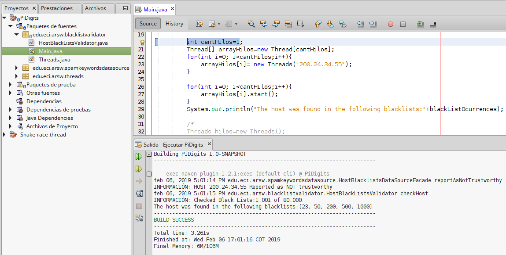
* As many threads as processing cores
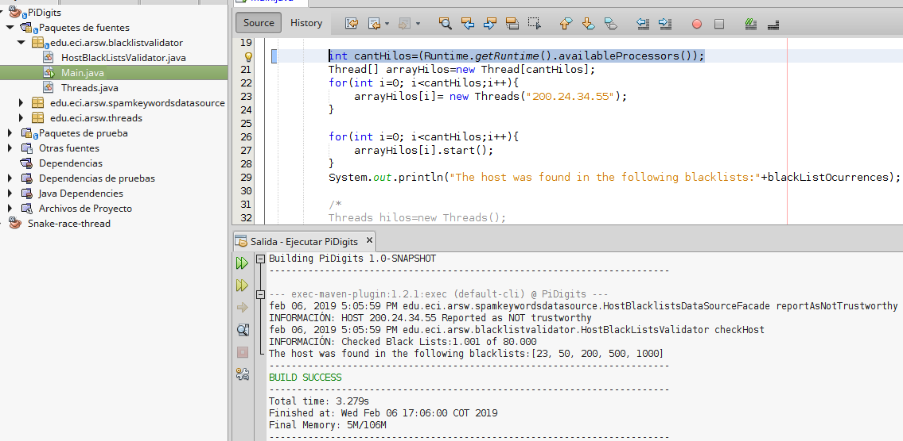
* As many threads as twice the number of processing cores. 
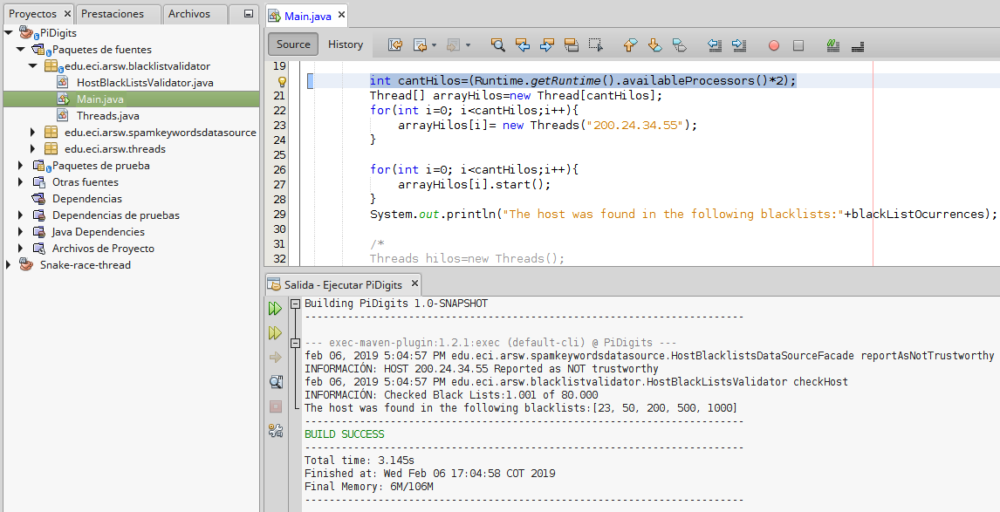
* 50 threads 
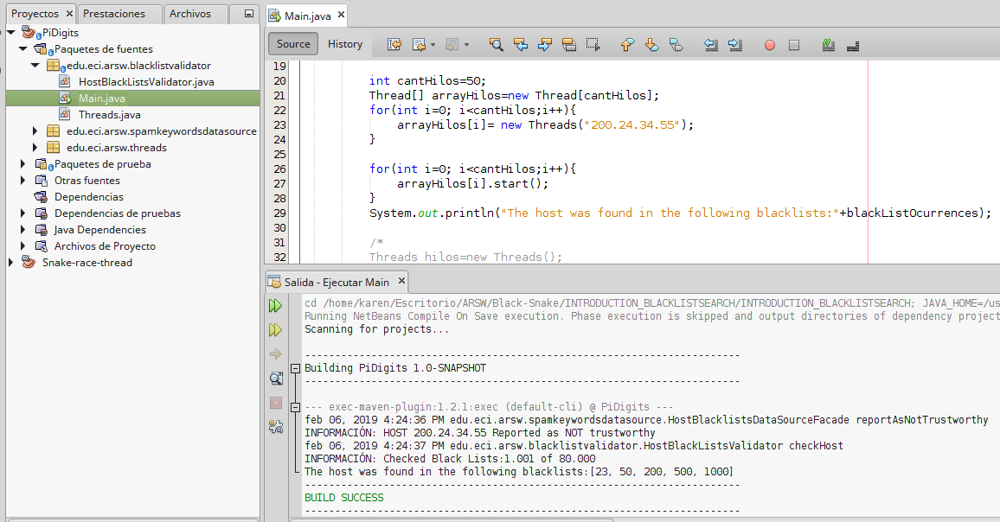
* 100 threads
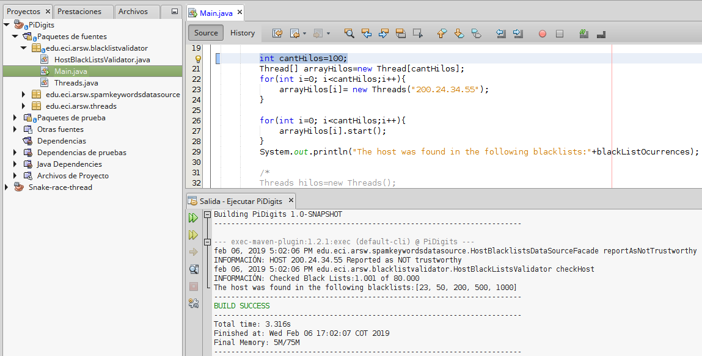

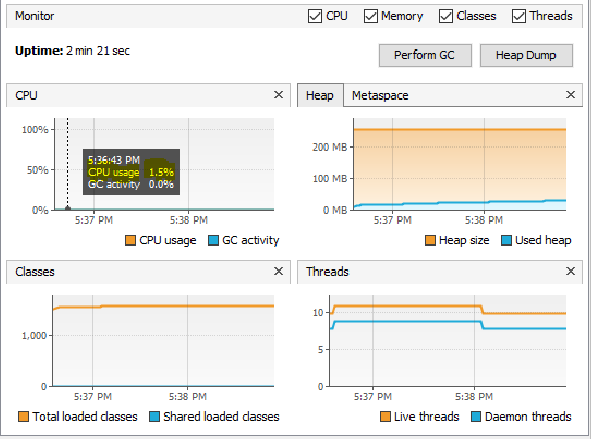

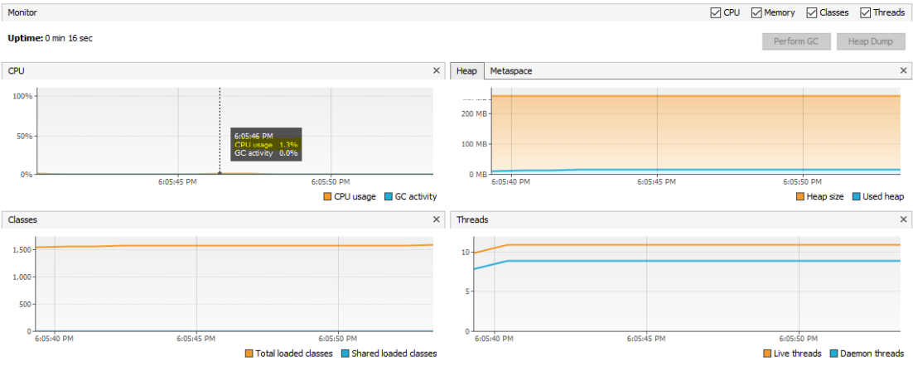

* According to Amdahls law, where S(n) is the theoretical improvement of performance, P the parallel fraction of the algorithm, and n the number of threads, the greater n, the better this improvement should be. Why is the best performance not achieved with the 500 threads?How is this performance compared when using 200 ?.

---> because there is a limit of threads and a limitation in the acceleration and in processors, if I put 200 threads the solution is [s(200)=1/(1-p)+p/200] and if I put 500 threads it is [s(500)=1/(1-p)+p/500].

* How does the solution behave using as many processing threads as cores compared to the result of using twice as much?
---> The solution and the execution time is similar.

* According to the above, if for this problem instead of 100 threads in a single CPU could be used 1 thread in each of 100 hypothetical machines, Amdahls law would apply better ?. If x threads are used instead of 100/x distributed machines (where x is the number of cores of these machines), would it be improved? Explain your answer.
--->I think you'll be better not overloading the capacity of the PC.

# Snake Race

# Part 1
- Modify the application in such way that each t milliseconds of thread execution, all the threads stop and show the number of primes found until that moment. Then, you have to wait until press ENTER in order to resume the threads execution.Use the synchronization mechanisms given by java (wait y notify, notifyAll).

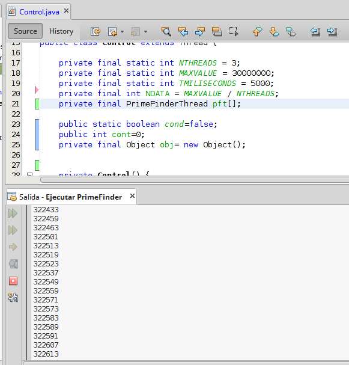

# Part 2

SnakeRace is an autonomous version, multi-snake of the famous game called 'snake' based on the Joao Andrade´s project-this exercise is a fork thereof

- N snakes works as an autonomous way.
- The collision concept does not exists among them. The only way that they die is by crashing against a wall.
- There are mice distributed along the game. As in the classic game, each time a snake eats  a mouse, it grows.
- There are some points (red arrows) that teleport the snakes.
- the rays causes that the snake increase its speed.

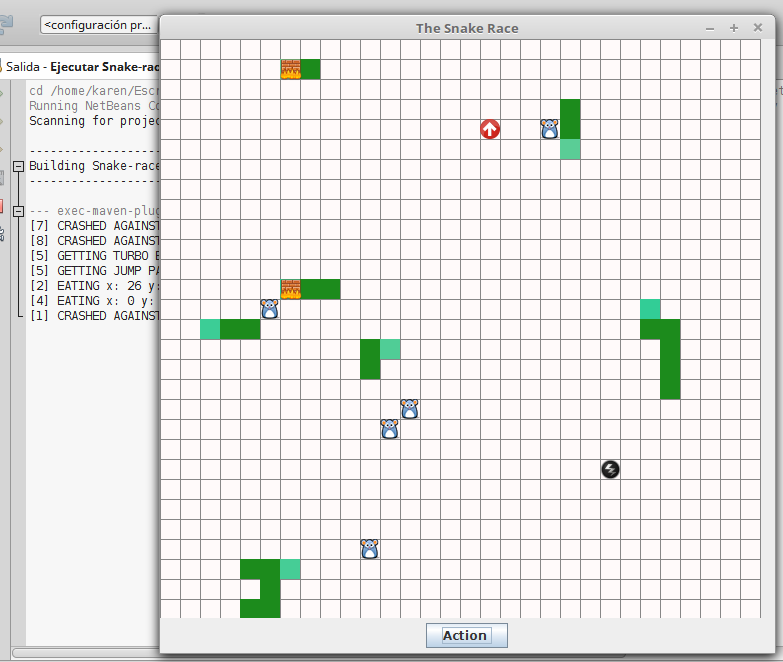
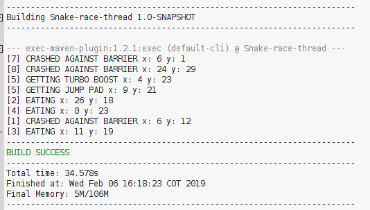

# Part 3

1. Analyse the code in order to understand how the threads are being used to create an autonomous behavior in the N snakes

2. Accordingly, and using the game logic, identify and write clearly (ANSWERS.txt file)

- Possible race conditions
---> At the moment when two or more snakes reach a specific "power" like the mouse, the arrow, the lightning or the firewall

---> When a snake collides with the firewall it does not move again

- An incorrect or inappropriate use of collections, considering its concurrent handling(For this increase the game speed and execute it multiples times until an error has been raised).
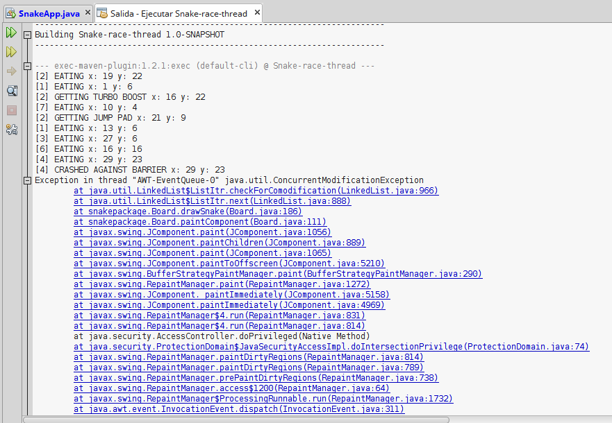
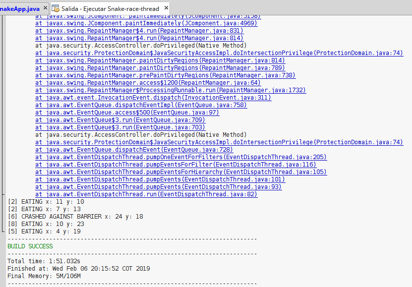

- Unnecessary use of active waits
---> When all stop moving the game does not end, although the threads if they finish the main thread is still active.
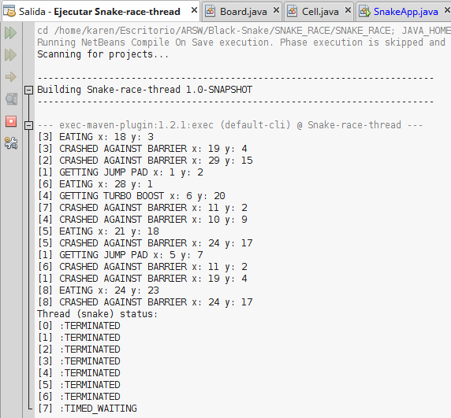

3. Identify critical regions associated with race conditions, and do something in order to eliminate them.Note that you have to synchronize strictly needed. In the answers document suggest the solution proposed for each item of the point 2. As the same way note that you don´t have to add more race conditions.

---> When two snakes reach a mouse or an arrow or the ray must be synchronized and put something that is a key to access the corresponding method and thus change the state of the snake, which makes that only the first one that arrives has the change of state.

---> When two snakes collide with a wall, it may only be assumed that one of them collides, then it must be synchronized so that the method stops the thread and informs the game so it can stop.

4. As you can see, the game is incomplete. Write code in order to implement functionallities through buttons in the GUI to start / Pause / Resume the game: start the game if it has not started, Pause the game if it is on, Resume the game if it is suspended. Keep in mind:
- When the game has been paused, in some point of the screen you have to show 
- the longest snake
- The worst snake:(the first snake  dead)Remember that the pause of the snakes are not instantanious, and you have to guarantee that all the information showed is consistent.
* Button
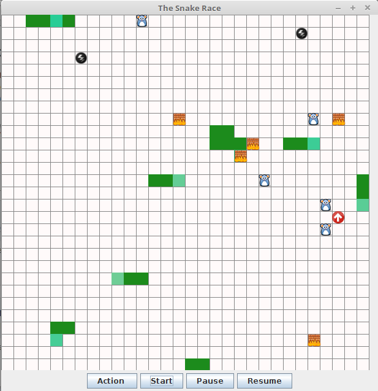

* pausa

* Resume

* Start

Created by Karen Mora
